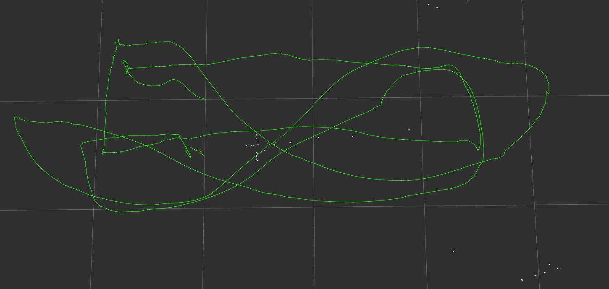

## Project2 Phase2 Report

### 															Jiawei Tang 20672550

#### Figures 

#### Implementations

* Feature detection:

  Base on OpenCV `cv::goodFeaturesToTrack()` function.

* Feature matching between left image and right image:

  Base on OpenCV `calcOpticalFlowPyrLK()` function.

* Generate 3D points

  Obtain the undistorted points in left and right images with `undistortedPts()` function, generate the 3D point with `generate3dPoints()` function. 

* Feature matching between current image and key image:

  Base on OpenCV `calcOpticalFlowPyrLK()` function.

* Get relative transformation between current frame and key frame:

  Obtain the undistorted points with `undistortedPts()` function, get $R_{ck}$ and $t_{ck}$ with `cv::solvePnPRansac()` function.

  $R_{ck}$ means the rotation matrix from current left camera frame to key frame.

  $t_{ck}$ means the translation vector from current left camera frame to key frame.

* Get current frame pose:

  Get $R_{kc}$ and $t_{kc}$ with obtained $R_{ck}$ and $t_{ck}$.  Get current pose based on composition rule for rigid body motions.

* Update latest states:

  Calculate the body frame pose used on  composition rule for rigid body motions.

#### Other things

* The comments on c_R_k  and c_t_k are confused. In my understanding:

  * c_R_k is the rotation matrix from current left camera to key frame.

  * c_t_k is the translation vector from current left camera to key frame.

* To deal with outliers, I used `findFundamentalMat()` function with RANSAC, this implementation is based on [VINS-MONO](https://github.com/HKUST-Aerial-Robotics/VINS-Mono/blob/master/feature_tracker/src/feature_tracker.cpp).