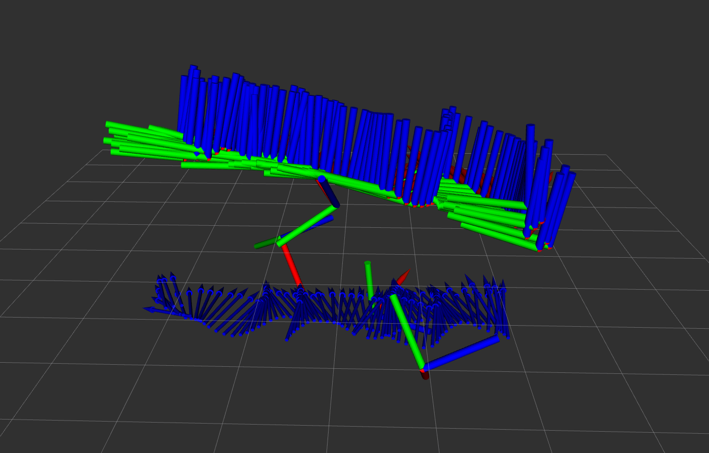
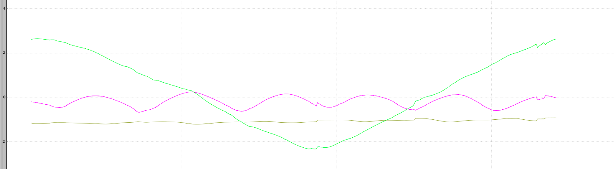
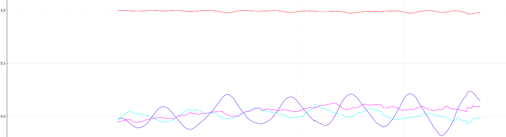
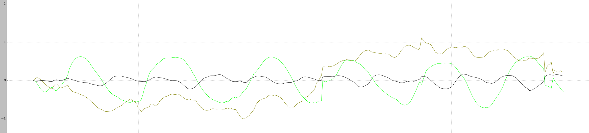

## Project3 Phase1 Report

### 															Jiawei Tang 20672550

#### Remainder

1. Modify the launch file

   I found some problem of my implementation on direct linear transformation (Project 2 Phase 1, SVD). Hence I simply use the `/tag_detector/odom_ref` as measurement by changing the `A3.launch` from line 1 to line 2

   ```javascript
   <remap from="~tag_odom" to="/tag_detector/odom_yourwork"/> 
   ```

   ```javascript
   <remap from="~tag_odom" to="/tag_detector/odom_ref"/>
   ```

   Please change the launchfile as mentioned or use provided launchfile to evaluate the result of  this project. I will fix the DLT issue later.

2. Modify the` CMakeList.txt`

   I put `find Eigen3` line before `set CMAKE _MODULE_PATH`, please use provided cmake file to compile.

   ```cmake
   find_package(Eigen3  REQUIRED)
   set(CMAKE_MODULE_PATH ${PROJECT_SOURCE_DIR}/cmake)
   ```

#### Figures

**Figure 1: RVIZ result**: 

* Axes: tag detection result by SolvePnP ($T_{cw}$)
* Arrow: EKF result  of body frame under camera frame ($T_{wi}$)



**Figure 2: rqt result of position**: 



**Figure 3: rqt result of orientation**: 



**Figure 4: rqt result of linear velocity**: 



#### Implementation

The implementation of this project is following with the materials in Lecture 9. More especially, The model is based P27-P33 Quadrotor with a Good Acceleration Sensor. The derivation of EKF is based on P13.

Since we trust the camera more, the covirance matrix $R$ is set to $0.01\times Identity(6)$, while covairance matrix of motion model $Q$ is set to $times diag(1,1,1,1,1,1,0.4,0.4,0.4,0.4,0.4,0.4)$. The initial convariance matrix of state $\Sigma$ is set to $0.5\times Identity(15)$.

By the way, I also implemented a Matlab version for fine turning. Which is under `script` folder.

#### Evaluation the result

Even through the result of EKF is much better than tag_detection result, as you can notice from the position result (figure 2), there are some discontinuities in the figure, which is caused by the outliers of tag detection result. Ransac should be used to eliminated this issue.