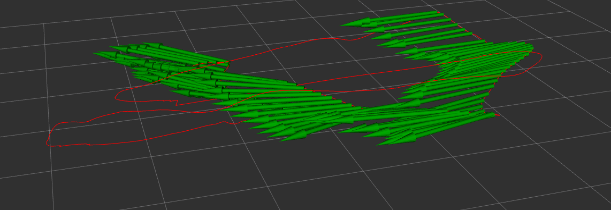
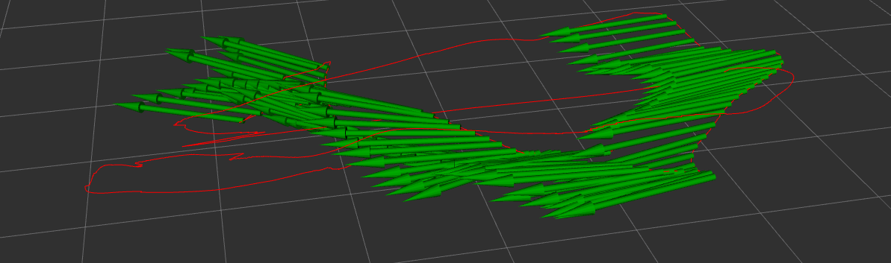
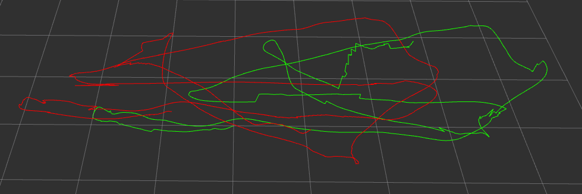

## Project 3 Phase 2 Report

### 															Jiawei Tang 20672550

#### Remainder

1. I use `backward.cpp` to debug, which requires `-ldw` in my `aug_ EKF` `CMakeLists.txt` (To be honest, I have not idea about what is `-ldw`) If you fail to build the project in your workspace, I can show demo to you in person.
2. The linearization part of G2 is based on the work of Zhengyu Fu. Actually we implemented that  with same method (Matlab Symbolic), but I make some problem when converting Matlab code to C++ code.

#### Figures

**Figure 1: Augmented EKF with simple bag**

* Red line: path
* Arrow: Augmented EKF odomentry result

**Figure 2: Augmented EKF with original bag**

**Figure 3: Comparison of VO and Augmented EKF with original bag**

#### Implementation

**Initialization**

I use the first PnP frame to initialize the fiter, and treat it as the first keyframe. Follow with augmented EKF.

**Augmented EKF work flow** 

Start with PnP_0:

1. If next frame is IMU:
   1. add to the end
   2. IMU predicition
2. if next frame is PnP:
   1. insert it to deque
   2. measurement update
   3. repropagate
3. if next frame is VO:
   1. if Keyframe changed:
      1. insert it to deque
      2. find the keyframe in deque
      3. repropagate 
   2. If keyframe not changed
      1. insert it to deque
      2. measurement update
      3. repropagate