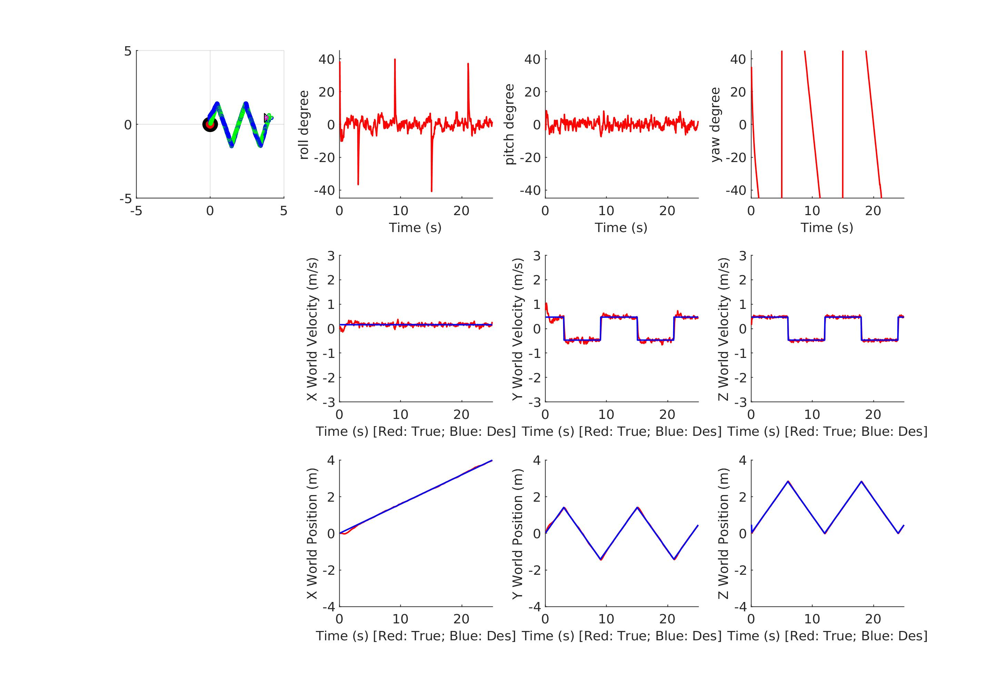
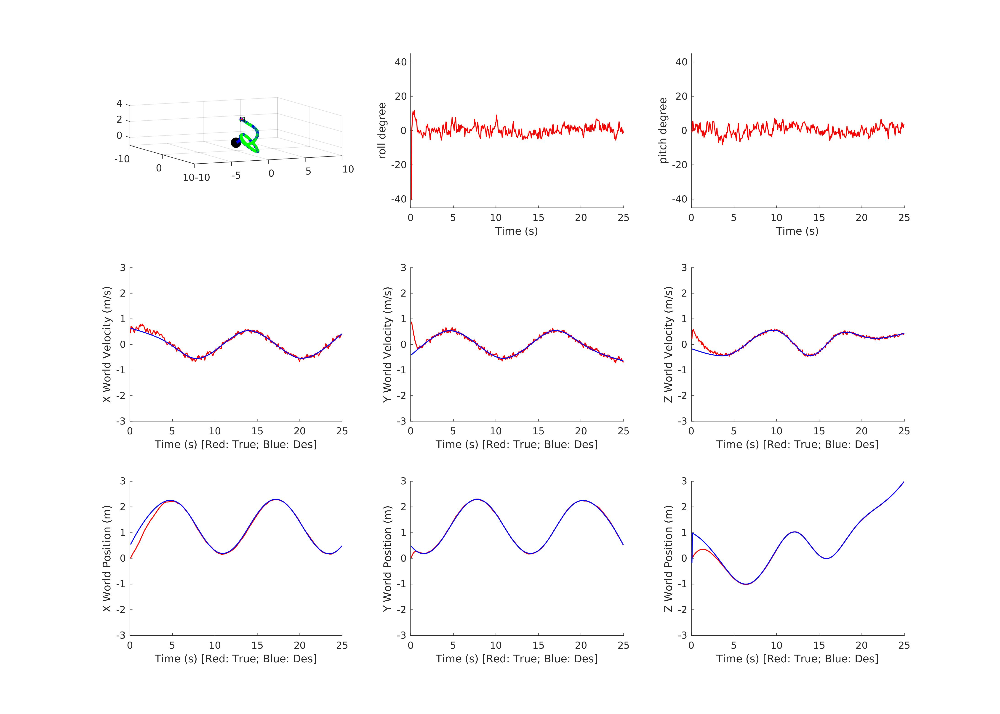
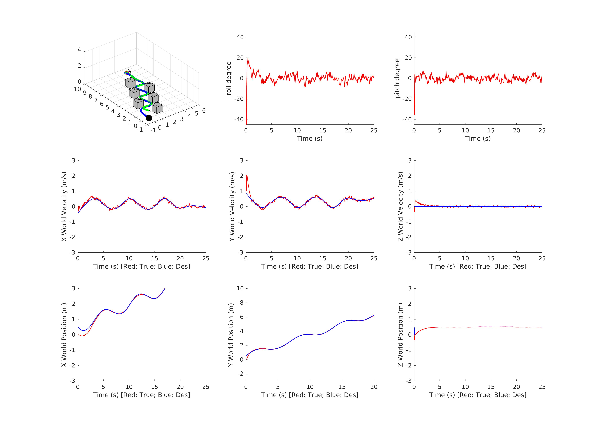
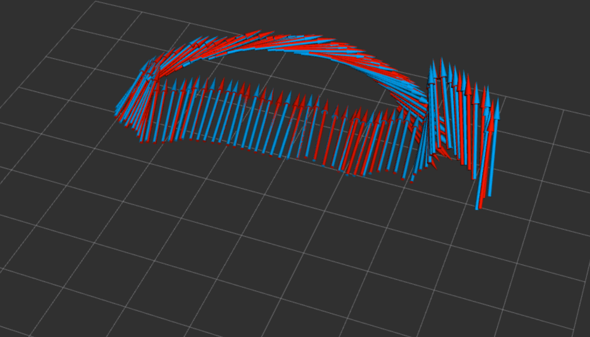
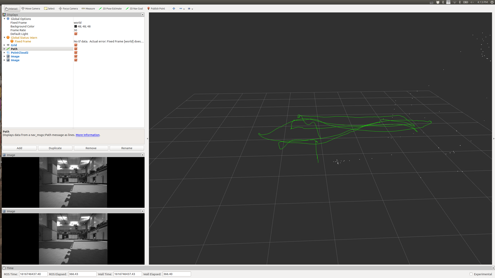

[toc]

# Source code for ELEC5660-2021

Source code of ELEC5660 Introduction to Aerial Robotics by [Prof. Shaojie Shen](https://facultyprofiles.ust.hk/profiles.php?profile=shaojie-shen-eeshaojie/) at HKUST.

C++ for Project 2-4, Matlab for Project 1.

This year we totally have 4 projects in this course, including 

- [x] Project 1 (Control and Planning)
  - [x] PID Quadrotor trajectory tracking control
  - [x] Minimum snap optimization-based trajectory generation
  - [x] Optimal path planning (A* + Dijkstra)
- [x] Project 2 (Visual estimator)
  - [x] 3D-2D Pose Estimation with Direct  Linear Transform (DLT)
  - [x] Visual Odometry with Stereo Camera
- [ ] Project 3 (EKF sensor fusion)
  - [x] EKF for quadrotor state estimation
- [ ] Project 4 (System integration on-board the drone)


## Project 1 (Control and Planning)

The project 1 is done in **MATLAB simulator**, where I implemented 1) Quadrotor trajectory tracking control; 2) Optimization-based trajectory generation;. 3) path planning + trajectory generation + control.

#### Phase 1 Result (PID)



#### Phase 2 Result (PID+Trajectory Generation)



#### Phase 3 Result (PID+A*+Trajectory Generation)



## Project 2 (Visual estimator)

The project 1 is done in **ROS ** with offline dataset. The code is done with C++. Two sub tasks are:

1. 3D-2D Pose Estimation with Direct  Linear Transform (DLT)
2. Visual Odometry with Stereo Camera

#### Phase 1 Result (Pose Estimation)



#### Phase 2 Result (Visual Odometry)




## Project 3 (Sensor Fusion)

The project 3 is done in **ROS ** with offline dataset. The code is done with C++. Two sub tasks are:

1. EKF for quadrotor state estimation.
2.   Augmented EKF

#### Phase 1 Result (EKF for Quadrotor State Estimation)


## Folder Structure

```
.
├── project1
│   ├── proj1phase1
│   │   ├── assignment.pdf
│   │   ├── code
│   │   ├── proj1phase1.md
│   │   ├── Project 1 Phase 1_Report_Jiawei_Tang.pdf
│   │   └── README.txt
│   ├── proj1phase2
│   │   ├── assignment.pdf
│   │   ├── code
│   │   ├── Project 1 Phase 2_Jiawei_Tang.pdf
│   │   └── README.txt
│   └── proj1phase3
│       ├── assignment.pdf
│       ├── code
│       ├── project1pahse3_Jiawei.md
│       ├── project1pahse3_Jiawei.pdf
│       └── README.txt
├── project2
│   ├── project2phase1
│   │   ├── aruco-1.2.4
│   │   ├── assignment.pdf
│   │   ├── project2pahse1_jiawei.pdf
│   │   ├── readme.md
│   │   └── tag_detector
│   └── project2phase2
│       ├── assignment.pdf
│       ├── camera_models
│       ├── img
│       ├── project2pahse2_Jiawei.md
│       ├── project2pahse2_Jiawei.pdf
│       ├── readme.md
│       └── stereo_vo_estimator
├── project3
│   ├── project3phase1
│   │   ├── assignment.pdf
│   │   ├── ekf
│   │   ├── img
│   │   ├── project3pahse1_Jiawei.md
│   │   ├── project3pahse1_Jiawei.pdf
│   │   ├── readme.md
│   │   └── script
│   └── project3phase1_Jiawei_Tang.zip
├── readme.md
└── testing
    └── angular_velocity.
```

